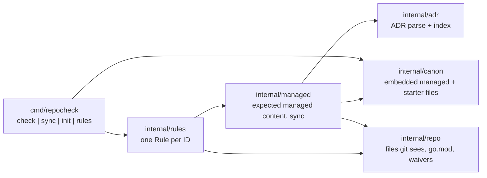

# repostd design

repostd distributes the discobox-ai repository standard and checks repos
against it. The standard is written once, as the `repostd` skill. Machine
checks enforce what can be checked; the skill carries the judgment rules.
[ADR 0001](docs/adr/0001-one-standard-enforced-by-repocheck-and-a-skill.md)
records the decisions and the alternatives rejected.

## Distributed files

- **Managed** files are owned by repostd: `.golangci.yml`,
  `.github/actions/task/action.yml`, `.github/actionlint.yaml`,
  `docs/adr/template.md`, and the skill.
  `sync` rewrites them, and `managed.files` fails on drift. The only
  repo-owned content is `.golangci.yml`'s `# repostd:local <name>` blocks,
  which sync carries over by name.
- The **ADR index** in `docs/adr/README.md` is managed content inside a
  repo-owned file, between `repostd:adr-index` markers.
- **Starter** files are written by `init` only when missing, rendered with
  `[[ ]]` template delimiters (Taskfiles and workflows own `{{ }}`), and
  owned by the repo afterwards. Rules check their shape, not their bytes.
- Every embedded file has a `.tmpl` suffix, so git, direnv, and repocheck do
  not treat repostd's templates as repostd's own files.
- repostd conforms to itself: its root copies of managed files come from
  `repocheck sync`, and `task verify` fails if they drift.

## Rules

- A rule is an ID, a one-line summary, and a check over `repo.Repo`. The IDs
  are the contract: the skill cites each one next to its rule text, and a
  test fails when the skill and `rules.All()` disagree.
- A check sees the files git lists (tracked plus untracked-not-ignored), so
  ignored build output never trips a rule.
- Waivers (`.repocheck.yaml`) match by rule and an optional path glob or
  directory prefix, and need a reason. Waived findings are counted, and
  listed with `-waived`.
- Warnings never fail. Only `docs.design-length` uses them, at 300 lines.
- Checks read structure, not semantics. YAML is parsed; `uses:` pinning is
  checked line by line because the version comment is not in the YAML
  model. Mermaid is checked for a known diagram type, not fully parsed.
